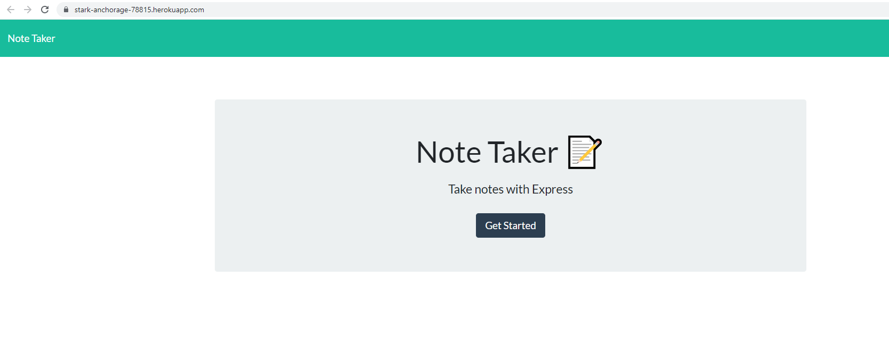
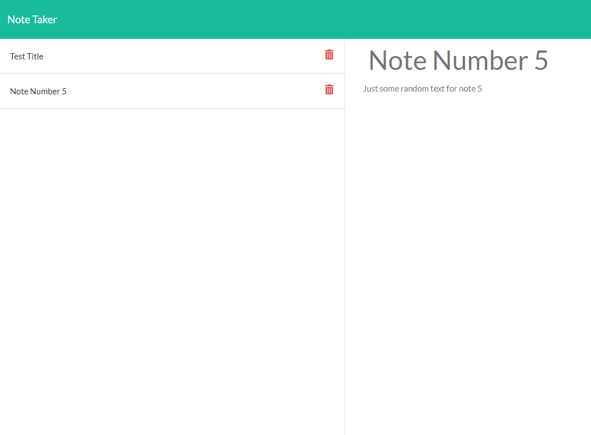

# Note_Taker

# User Story
AS A small business owner  
I WANT to be able to write and save notes  
SO THAT I can organize my thoughts and keep track of tasks I need to complete

# Description
 This is a simple note taker application used for writing, saving and deleting notes using Express.
 

# Table of Content
- [Technologies](#Technologies)
- [Installation](#Installation)
- [Usage](#Usage)
- [Contributing](#Contributing)
- [Questions](#Questions)
 

# Link Deployed At
 * [Heroku](https://stark-anchorage-78815.herokuapp.com/)

# Technologies
* JavaScript
 * Node.js
 * Express.js

# Installation
 After you clone the repository, you have to run   ***npm install*** or ***npm i***  in your command line to download all the dependencies.
 

# Usage
 Once you install all the dependecies,  
 In your command line run   ***node server.js***  
 Successful server connection will be a message that reads   ***"Server is listening on port: 3000"***  
 To view the application, go to your browser and type  ***http://localhost:3000/*** in the search bar.
 

# Contributing
 Contributors in this project: Me
 

# Questions

 Questions or comments?  Contact me at: 
 GitHub: https://github.com/cdcolbert
